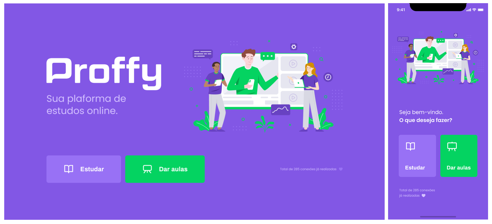

# Next Level Week #2 :rocket:

__Proffy__ - Projeto code-along da segunda edição da [Next Level Week 2](https://nextlevelweek.com/inscricao/2), trilha Omnistack, de 3/8/2020 a 8/8/2020. O projeto conta com um webapp em React, um app mobile em React Native e um banco de dados SQL.

Para visualizar o projeto, execute o comando `npm start` dentro de cada pasta.

A premissa é manter o padrão inicial - uma plataforma para se conectar com professores de diversas áreas - e adicionar novas features com o passar do tempo.

__Ideias de melhorias são bem-vindas!__ :grin:

## Alterações pontuais

As seguintes alterações não fazem parte do escopo do evento e estão previstas ou já foram feitas:

### Web

- [x] Altaração do input de ~~data~~ horário
- [x] Alteração do input de seleção
- [x] Correção de bug no textarea
- [x] Alterar o botão de busca da página de professores
- [x] Converter os botões em um component
- [ ] Alterar a filtragem de professores
- [x] Fazer todos os professores dispoíveis aparecem quando não há filtragem ativa
- [x] Criar component de 'Carregando...'
- [ ] Criar área logada para professores
- [ ] Criar área logada para alunos
- [x] Alterar a caixa de inclusão de horários disponíveis
- [x] Implementar SASS para facilitar a manutenção do CSS
- [x] Alterar input de número de telefone

### Mobile

- [ ] Adaptar as novas features da versão web para mobile

### DB

- [x] Criar rota PUT para professores
- [x] Criar rota DELETE para professores
